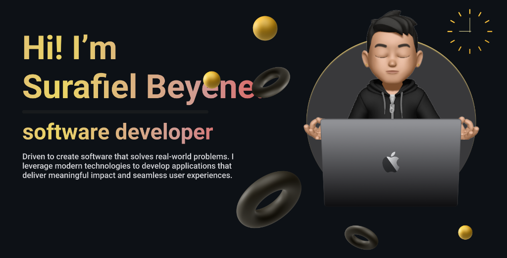

<div align="center">
  
</div>

<h1 align="center">
  
</h1>

<p align="center">
  
  <a href="https://linkedin.com/in/surafiel-beyene-88375427b"></a>
  <a href="https://sura-portfolio.onrender.com"></a>
</p>

---

## 👨‍💻 About Me

```javascript
const surafiel = {
    location: "Addis Ababa, Ethiopia 🇪🇹",
    role: "Cybersecurity Engineer & Software Developer",
    currentFocus: "Building secure and resilient systems",
    learning: ["System Design", "Network Security", "Penetration Testing", "Security Architecture"],
    interests: ["Cybersecurity", "Threat Intelligence", "Secure Software Development", "Ethical Hacking"],
    funFact: "I turn coffee into code ☕ → 💻"
};
```


### 🚀 What I Do

- 🔭 Designing and implementing **secure systems** and **security architectures**
- 🌱 Currently mastering **System Design** and **Network Security**
- 💡 Passionate about **cybersecurity best practices** and **threat mitigation**
- 🎯 Focused on **protecting digital assets** and **securing infrastructure**
- 🤝 Open to **collaborate** on security-focused projects
- �️ Experienced in **vulnerability assessment** and **security hardening**

### 📫 Get In Touch

- **Email:** [surafielb41@gmail.com](mailto:surafielb41@gmail.com)
- **Phone:** +251 941 337 762
- **Portfolio:** [sura-portfolio.onrender.com](https://sura-portfolio.onrender.com)
- **LinkedIn:** [Surafiel Beyene](https://linkedin.com/in/surafiel-beyene-88375427b)

### 🏅 Awards & Achievements

- 🥇 **Medal for Academic Excellence** - Woldia University (2025)
- 🎓 **Bachelor of Science in Computer Science** 
- 📝 **National Exit Examination** - Score: **72%** (June 2025)
- ⭐ Recognized for **outstanding academic dedication** and performance

---

## 🛠️ Tech Stack

### Languages
<p>
  
  
  
  
</p>

### Frontend Development
<p>
  
  
  
  
</p>

### Backend Development
<p>
  
  
</p>

### Database
<p>
  
</p>

---

## 📊 GitHub Statistics

<div align="center">
  
  
</div>

<div align="center">
  
</div>

<div align="center">
  
</div>

---

## 💼 Featured Projects

Coming soon! Check out my [portfolio](https://sura-portfolio.onrender.com) for my latest work.

---

<div align="center">
  
</div>

<div align="center">
  <h3>⭐ Show some love by starring my repositories! ⭐</h3>
  <p>Made with ❤️ by Surafiel Beyene</p>
</div>
